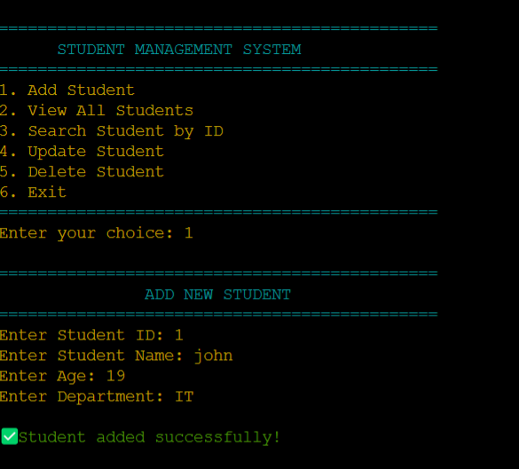

# **Student Management System (C Program)**
A simple **Student Management System** built in **C**, which allows users to **add, view, search, update, and delete student records** using a file-based storage system.

## **📌 Features**
- **Add Student** – Add new student records to `students.txt`.  
- **View Students** – Display all stored student records.  
- **Search Student** – Search for a student by ID.  
- **Update Student** – Modify student details.  
- **Delete Student** – Remove a student from the records.  
- **User-friendly Menu** – A **terminal-based** interactive menu system.  
- **Colorful Output** – Uses **Green (Success), Red (Errors), Yellow (Warnings)** for better readability.  

---

## 🔧 Requirements  
Before running this program, ensure that you have the following:  
- A **C compiler** (such as **GCC**) installed  
  ```sh
  # Install GCC on Ubuntu/Debian
  sudo apt update && sudo apt install gcc
  ```  
  ```sh
  # Install GCC on Windows (via MinGW)
  winget install -e --id MSYS2.MSYS2 
  ``` 
- A **terminal** or **command prompt**
- A text editor (**VS Code**, **Notepad++**, etc.)

---

## **Installation and Usage**
### **1. Clone or Download the Project**
```sh
git clone https://github.com/Dibyaranjan27/c-programming-projects.git
cd student-management-system
```

### **2. Compile the program**
```sh
gcc student_management.c -o student_management
```
### **3. Run the program**
```sh
./student_management
```

---

## 🚀 Usage
1. Select an option from the menu
2. Enter student details when prompted
3. Perform operations like adding, searching, updating, and deleting records 

---

## 🖥️ Example Output


---

## 📂 File Structure

```
/student-management-system  
│── student_management.c    # Main C program  
│── students.txt            # Stores student records  
│── README.md               # Documentation  
```

## 🤝 Contribution
Feel free to contribute! Fork the repository, make improvements, and submit a pull request. 😊

## 📜 License
This project is open-source and available under the MIT License.

## 💡 Author
Dibyaranjan Maharana  
[GitHub](https://github.com/Dibyaranjan27)  | [LinkedIn](https://www.linkedin.com/in/dibyaranjan-maharana-1228012b2/) 
